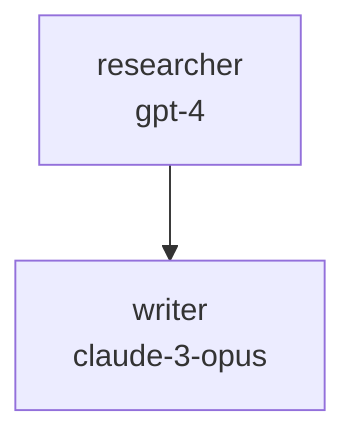
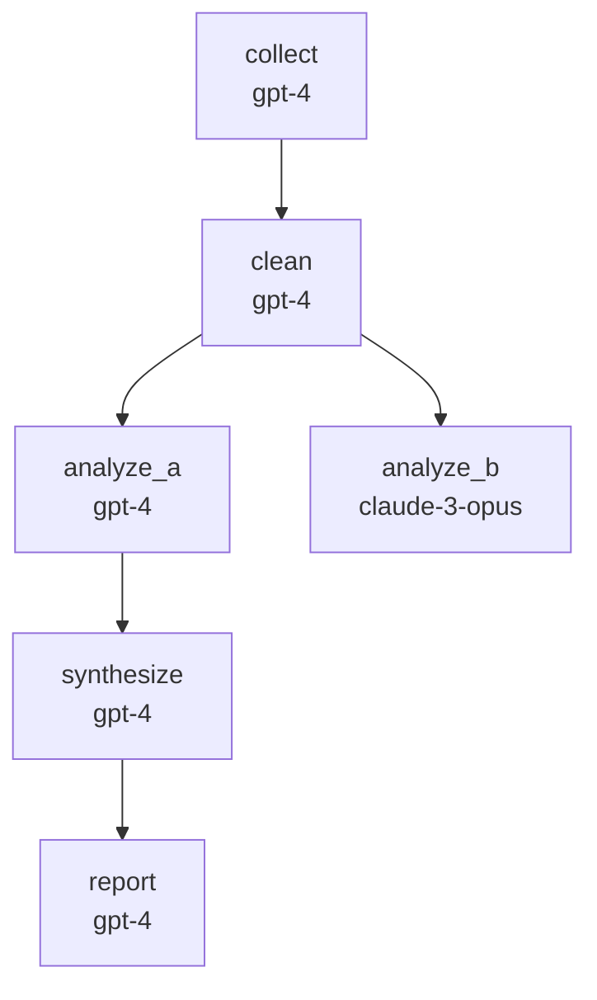
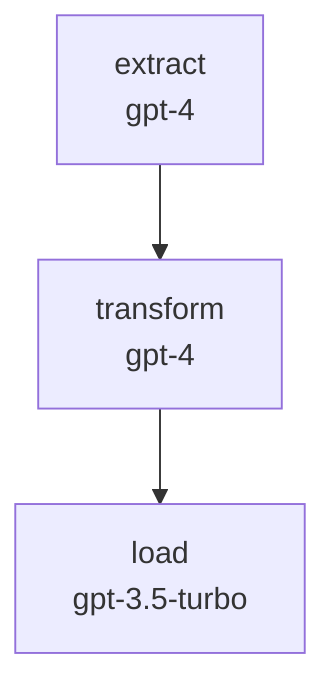
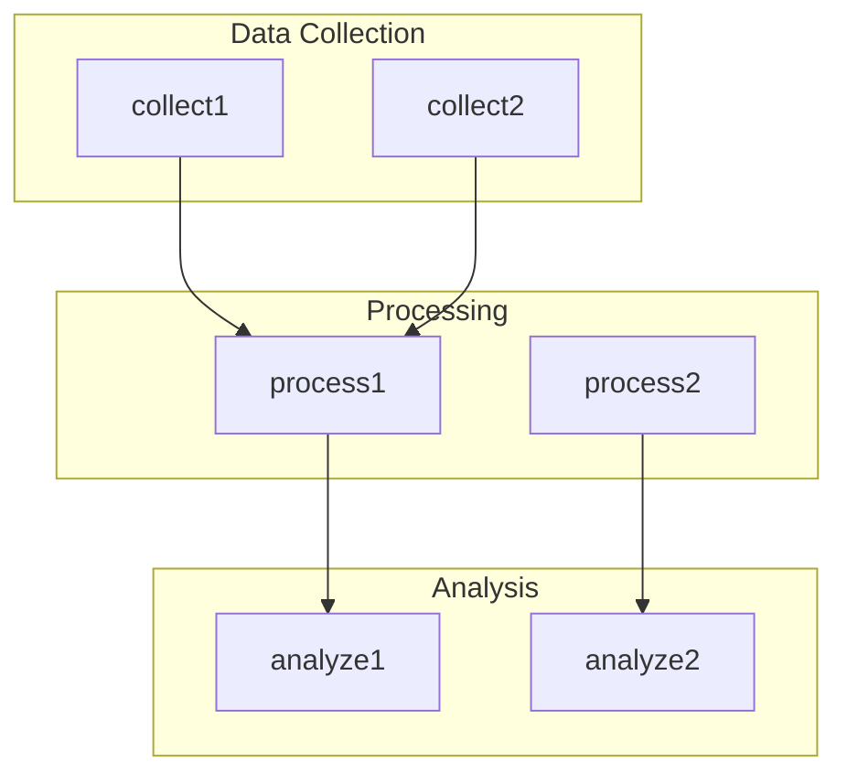

# Visualization

Working with dependency graphs and visual representations in Weave.

## Graph Command

The `weave graph` command visualizes agent dependencies.

```bash
weave graph                    # ASCII output
weave graph --format mermaid   # Mermaid diagram
weave graph --output file.mmd  # Save to file
```

---

## ASCII Visualization

### Basic Example

```bash
weave graph
```

**Output:**
```
📊 Dependency Graph: content_pipeline

       ┌──────────────┐
       │  researcher  │
       │    gpt-4     │
       └──────┬───────┘
              │
              ▼
       ┌──────────────┐
       │   writer     │
       │ claude-3-..  │
       └──────┬───────┘
              │
              ▼
       ┌──────────────┐
       │   editor     │
       │    gpt-4     │
       └──────────────┘

Execution order: researcher → writer → editor
```

### Linear Pipeline

```yaml
agents:
  A: {model: "gpt-4"}
  B: {model: "gpt-4", inputs: "A"}
  C: {model: "gpt-4", inputs: "B"}
```

```
       ┌──────────┐
       │    A     │
       │  gpt-4   │
       └────┬─────┘
            │
            ▼
       ┌──────────┐
       │    B     │
       │  gpt-4   │
       └────┬─────┘
            │
            ▼
       ┌──────────┐
       │    C     │
       │  gpt-4   │
       └──────────┘
```

### Branching Pipeline

```yaml
agents:
  source: {model: "gpt-4"}
  branch_a: {model: "gpt-4", inputs: "source"}
  branch_b: {model: "gpt-4", inputs: "source"}
```

ASCII shows sequential execution (v0.1.0):
```
       ┌──────────┐
       │  source  │
       └────┬─────┘
            │
            ▼
       ┌──────────┐
       │ branch_a │
       └────┬─────┘
            │
            ▼
       ┌──────────┐
       │ branch_b │
       └──────────┘
```

---

## Mermaid Diagrams

### Generating Mermaid

```bash
weave graph --format mermaid
```

**Output:**
```
graph TD
    researcher["researcher<br/>gpt-4"]
    writer["writer<br/>claude-3-opus"]
    editor["editor<br/>gpt-4"]
    researcher --> writer
    writer --> editor
```

### Viewing Mermaid Diagrams

#### Option 1: Mermaid Live Editor

1. Copy the Mermaid output
2. Go to [mermaid.live](https://mermaid.live)
3. Paste and view

#### Option 2: GitHub/GitLab

Mermaid renders automatically in markdown:

````markdown

````

#### Option 3: VS Code

Install Mermaid extension:
1. Install "Markdown Preview Mermaid Support"
2. Open markdown file with mermaid code block
3. Preview renders the diagram

#### Option 4: Save to File

```bash
weave graph --format mermaid --output architecture.mmd
```

Then use any Mermaid viewer to open `architecture.mmd`.

---

## Export Examples

### Save ASCII Graph

```bash
# Save to file
weave graph > graph.txt

# With specific config
weave graph --config prod.yaml > prod-graph.txt
```

### Save Mermaid Diagram

```bash
# Save diagram
weave graph --format mermaid --output diagram.mmd

# Include in documentation
weave graph --format mermaid --output docs/architecture.mmd
```

### Generate Multiple Weaves

```bash
# Graph for each weave
weave graph --weave pipeline1 --format mermaid -o pipeline1.mmd
weave graph --weave pipeline2 --format mermaid -o pipeline2.mmd
weave graph --weave pipeline3 --format mermaid -o pipeline3.mmd
```

---

## Complex Graphs

### Example: Multi-Stage Pipeline

```yaml
agents:
  collect: {model: "gpt-4"}
  clean: {model: "gpt-4", inputs: "collect"}
  analyze_a: {model: "gpt-4", inputs: "clean"}
  analyze_b: {model: "claude-3-opus", inputs: "clean"}
  synthesize: {model: "gpt-4", inputs: "analyze_a"}
  report: {model: "gpt-4", inputs: "synthesize"}
```

**ASCII:**
```
       ┌──────────┐
       │ collect  │
       └────┬─────┘
            │
            ▼
       ┌──────────┐
       │  clean   │
       └────┬─────┘
            │
            ▼
       ┌──────────┐
       │analyze_a │
       └────┬─────┘
            │
            ▼
       ┌──────────┐
       │analyze_b │
       └────┬─────┘
            │
            ▼
       ┌──────────┐
       │synthesize│
       └────┬─────┘
            │
            ▼
       ┌──────────┐
       │  report  │
       └──────────┘
```

**Mermaid:**


---

## Understanding Graph Output

### Node Format

**ASCII:**
```
       ┌──────────────┐
       │  agent_name  │    ← Agent name
       │  model_name  │    ← Model being used
       └──────┬───────┘
```

**Mermaid:**
```
agent_name["agent_name<br/>model_name"]
```

### Edge Format

**ASCII:**
```
       │               ← Dependency arrow
       ▼
```

**Mermaid:**
```
source --> target      ← Dependency arrow
```

### Execution Order

Always shown at the bottom:
```
Execution order: A → B → C
```

---

## Documentation Workflow

### 1. Generate Diagrams

```bash
# Generate for all weaves
weave graph --weave etl_pipeline -f mermaid -o docs/etl.mmd
weave graph --weave ml_pipeline -f mermaid -o docs/ml.mmd
weave graph --weave api_pipeline -f mermaid -o docs/api.mmd
```

### 2. Include in Markdown

```markdown
# Architecture

## ETL Pipeline


````

### 3. Keep Updated

```bash
#!/bin/bash
# update-docs.sh

echo "Updating architecture diagrams..."

weave graph --weave etl -f mermaid -o docs/etl.mmd
weave graph --weave ml -f mermaid -o docs/ml.mmd
weave graph --weave api -f mermaid -o docs/api.mmd

echo "Done!"
```

---

## Debugging with Graphs

### Verify Dependencies

```bash
# Check if dependencies are correct
weave graph
```

Look for:
- Unexpected connections
- Missing connections
- Wrong execution order

### Example Problem

**Config:**
```yaml
agents:
  A: {model: "gpt-4"}
  B: {model: "gpt-4", inputs: "C"}    # Should depend on A
  C: {model: "gpt-4", inputs: "A"}
```

**Graph shows:**
```
A → C → B
```

**Should be:**
```
A → B → C
```

**Fix:**
```yaml
agents:
  A: {model: "gpt-4"}
  B: {model: "gpt-4", inputs: "A"}    # Fixed
  C: {model: "gpt-4", inputs: "B"}    # Fixed
```

---

## Comparison: ASCII vs Mermaid

### ASCII

**Pros:**
- Works in any terminal
- No external tools needed
- Quick preview
- Readable in logs

**Cons:**
- Limited layout options
- Hard to read for complex graphs
- Sequential display only

**Use for:**
- Quick checks
- Terminal workflows
- CI/CD logs

### Mermaid

**Pros:**
- Better layout for complex graphs
- Shows parallel paths clearly
- Renders beautifully in docs
- Interactive (in some viewers)

**Cons:**
- Requires viewer/renderer
- More verbose syntax

**Use for:**
- Documentation
- Presentations
- Complex pipelines
- GitHub/GitLab repos

---

## Advanced Tips

### Large Graphs

For large pipelines, use Mermaid with subgraphs:



### Color Coding (Future)

v2.0 may support color coding:
- Green: Completed
- Yellow: Running
- Red: Failed
- Gray: Pending

### Interactive Graphs (Future)

v3.0 may include web UI with:
- Clickable nodes
- Zoom/pan
- Real-time updates
- Execution status overlay

---

## Integration Examples

### CI/CD Pipeline

```yaml
# .github/workflows/validate.yml
name: Validate Weave Config

on: [push]

jobs:
  validate:
    runs-on: ubuntu-latest
    steps:
      - uses: actions/checkout@v2
      - name: Install Weave
        run: pip install weave-cli
      - name: Validate Config
        run: weave plan
      - name: Generate Graph
        run: weave graph --format mermaid --output graph.mmd
      - name: Upload Artifact
        uses: actions/upload-artifact@v2
        with:
          name: dependency-graph
          path: graph.mmd
```

### Documentation Site

```bash
# Generate docs
weave graph --format mermaid --output docs/architecture.mmd

# Build with MkDocs, Docusaurus, etc.
mkdocs build
```

---

## Next Steps

- [CLI Commands](../reference/cli-commands.md) - Complete command reference
- [Dependencies](dependencies.md) - Understanding dependency patterns
- [Writing Configurations](writing-configs.md) - Best practices
