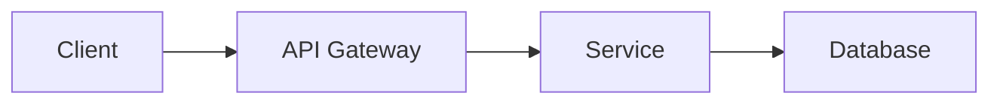

# Documentation Guide

Guidelines for creating clear, comprehensive technical documentation.

## Documentation Types

### 1. README.md (Project Overview)

Essential sections:
```markdown
# Project Name

Brief one-line description

## Features
- Key feature 1
- Key feature 2
- Key feature 3

## Installation

```bash
pip install package-name
```

## Quick Start

```python
from package import Module

# Basic usage example
result = Module.do_something()
```

## Configuration

| Option | Type | Default | Description |
|--------|------|---------|-------------|
| timeout | int | 30 | Request timeout |

## Documentation

Full docs: https://docs.example.com

## Contributing

See [CONTRIBUTING.md](CONTRIBUTING.md)

## License

MIT
```

### 2. API Documentation

For each public function/method:

```python
def process_payment(
    amount: Decimal,
    currency: str = "USD",
    metadata: Optional[Dict] = None
) -> PaymentResult:
    """Process a payment transaction.

    Args:
        amount: Payment amount (must be positive)
        currency: Three-letter ISO currency code
        metadata: Optional transaction metadata

    Returns:
        PaymentResult with transaction ID and status

    Raises:
        ValueError: If amount is negative or zero
        PaymentError: If payment processing fails

    Example:
        >>> result = process_payment(
        ...     amount=Decimal("19.99"),
        ...     currency="USD",
        ...     metadata={"order_id": "123"}
        ... )
        >>> print(result.transaction_id)
        'txn_abc123'
    """
```

### 3. Architecture Documentation

Include:
- System overview diagram
- Component relationships
- Data flow diagrams
- Deployment architecture
- Technology stack
- Design decisions and trade-offs

### 4. User Guide

Structure:
1. **Getting Started**: Installation, setup
2. **Tutorials**: Step-by-step walkthroughs
3. **How-To Guides**: Specific tasks
4. **Reference**: Complete API docs
5. **Troubleshooting**: Common issues

### 5. Developer Guide

Topics:
- Development environment setup
- Build and test instructions
- Code style guidelines
- Git workflow and branching
- Pull request process
- Release process

## Writing Style

### Be Clear and Concise
- Use simple language
- Short paragraphs (2-3 sentences)
- Active voice ("Click the button" not "The button should be clicked")
- Second person ("you") for user-facing docs

### Be Specific
- ❌ "Set the timeout to a reasonable value"
- ✅ "Set the timeout to 30-60 seconds"

### Use Examples
- Show, don't just tell
- Include code examples for complex concepts
- Provide both simple and advanced examples
- Show common use cases

### Structure Content
- Use headings hierarchically (H1 → H2 → H3)
- Use lists for multiple items
- Use tables for structured data
- Use code blocks with syntax highlighting

## Code Examples

Best practices:
```python
# ✅ Good: Complete, runnable example
from myapp import User, Database

db = Database("localhost:5432")
user = User(name="Alice", email="alice@example.com")
db.save(user)

# ❌ Bad: Incomplete, unclear
user = User()
user.save()  # Where does this save to?
```

Include:
- Imports needed
- Setup/initialization
- Main operation
- Cleanup (if needed)
- Expected output

## Documentation Formatting

### Code Blocks

Use language-specific syntax highlighting:

```python
# Python code
def hello():
    print("Hello, World!")
```

```bash
# Shell commands
npm install package-name
```

### Emphasis

- **Bold** for UI elements: "Click the **Save** button"
- *Italic* for emphasis: "This is *important*"
- `Code` for inline code: "Use the `process()` function"

### Admonitions

> **Note**: Additional information
>
> **Warning**: Important caution
>
> **Tip**: Helpful suggestion

### Links

- Use descriptive link text
- ❌ "Click [here](url) for more info"
- ✅ "See the [API reference](url) for details"

## Diagrams

Use when appropriate:
- Architecture diagrams (system design)
- Sequence diagrams (API flows)
- Entity-relationship diagrams (data models)
- Flowcharts (decision logic)

Tools:
- Mermaid (text-based, version-controllable)
- Draw.io / Excalidraw
- PlantUML

Example Mermaid diagram:


## Documentation Maintenance

- Update docs with code changes
- Review docs in pull requests
- Check for outdated information regularly
- Remove deprecated content
- Keep examples working

## Checklist

- [ ] README with installation and quick start
- [ ] All public APIs documented
- [ ] Code examples included
- [ ] Error cases documented
- [ ] Configuration options explained
- [ ] Architecture overview provided
- [ ] Changelog maintained
- [ ] Migration guides for breaking changes
